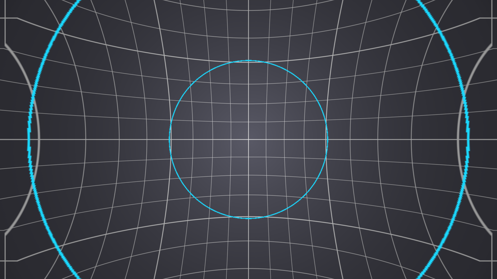

# Vertigo user guide

Vertigo is **the dolly zoom — the shot where one thing holds still and the world moves** — as an
FFGL effect for [Resolume](https://resolume.com) Arena and Avenue, and an OpenFX effect for
DaVinci Resolve, Nuke, Natron and Vegas.

A dolly zoom is one camera move and one lens move arranged to cancel. The camera tracks along its
own axis; the focal length changes to hold one surface at exactly the size it already was. That
surface does not move, and everything at any other distance does — which is why it reads as the
ground giving way rather than as a zoom.



> **Before you rely on this:** the maths is measured against an independent implementation across
> 180 parameter combinations, agreeing to within **0.9 of an 8-bit level**; the depth solve against
> the same solve in double across 45 more (0.8 levels); and the anchor surface is confirmed not to
> move **at all** — 0.0000 of travel, while the rest of the frame travels up to a quarter of the
> picture. All 12 controls reach the picture.
>
> **It runs in Resolume Arena**, loaded and confirmed working. It has **never been loaded into
> Resolve** or any other OpenFX host, the **Windows build has never been run** (it compiles in CI
> and ships), and **nothing has been timed** — Best quality is 16 samples per pixel and each one
> runs the depth solve three times in the Luma and Alpha modes, and nobody has measured what that
> costs at 4K.
>
> This codebase was created with AI assistance, directed and reviewed by a human author.

---

## Installing

```
~/Documents/Resolume Arena/Extra Effects        Vertigo.bundle (macOS) / Vertigo.dll (Windows)
~/Documents/Resolume Avenue/Extra Effects
```

Restart Resolume; it appears under Effects as **Vertigo**.

For OpenFX, put `Vertigo.ofx.bundle` in `/Library/OFX/Plugins` (macOS),
`C:\Program Files\Common Files\OFX\Plugins` (Windows) or `/usr/OFX/Plugins`
(Linux). It appears under the **Stoatworks** group.

The macOS builds are Developer ID-signed and notarised. The Windows builds are unsigned, but only
the installer trips SmartScreen — see [UNSIGNED.md](UNSIGNED.md).

---

## Where the depth comes from — read this first

It is a **depth** effect, and a video clip has no depth. So the honest part of this plugin is where
the depth comes from, and there are two answers.

**Radial invents a field** — near on the optical axis, falling away to the frame corners, or the
reverse. Nothing is read out of the picture, so the geometry is a closed form with no failure
cases, no holes and no dependence on what the clip contains. **It works on any footage at all**,
and what it gives you is the *look* of the shot.

**Luma and Alpha read a field out of the clip.** Given real depth — a rendered depth pass, a matte,
a generated depth map baked into a channel — this is the actual reprojection, and the picture comes
apart in depth the way the real move does. Given an ordinary clip it turns brightness into
geometry, which is either a mistake or an effect, depending on the clip.

Start on **Radial** unless you know your footage carries depth.

---

## The shot

| Control | What it does |
|---|---|
| **Dolly** | How far the camera travels. 0.5 is no move; below is a pull back, above is a push in. It is geometric in the parallax ratio between the nearest surface and infinity, so equal travel either side of the middle gives exactly reciprocal shots. |
| **Relief** | How much depth the scene has. 0.5 is flat — and a flat scene cannot be dolly-zoomed, so that is a true null however hard the dolly is driven. Below 0.5 turns the depth inside out: the middle becomes the far end, which is the stairwell shot rather than the subject shot. |
| **Anchor** | Which depth is held fixed. 1 is the nearest surface, 0 the furthest. In Radial, 1 is the optical axis and 0 the frame corners. |

**There are two nulls, and both are exact.** Dolly at the middle is no move; Relief at the middle
is a scene with no depth. Either gives back the original picture byte for byte at Quality = Fast.
That is worth knowing because it means neither control has a dead zone to hunt for — the middle is
genuinely the middle.

---

## Depth shaping

**Falloff** is gamma on the depth field: where between the near and far ends most of the scene
sits. 0.5 is linear.

**Smooth** blurs the depth field, **not** the picture. It does nothing in Radial, which is already
smooth; on a real depth map it is what stops a hard depth step smearing.

## Frame and output

**Centre X / Centre Y** put the optical axis where the subject is — the move is about that point,
so this is the first thing to set on any shot where the subject is not dead centre.

**Overscan** scales the picture to buy back the frame that a push in gives away.

**Edges** decides what to show where a push in looks past the picture: Transparent, Black, Clamp,
Mirror or Wrap.

**Quality** is supersampling — Fast is 1 sample per pixel, Good 4, Best 16. **It does not change
the geometry, only how it is sampled.**

---

## The direction that has no artefacts

**Pulling back magnifies the background**, which means reading from *inside* the picture, so
nothing ever reaches the frame edge. **Pushing in shrinks it**, which means reading from *beyond*
the picture — and that is what Edges and Overscan exist for.

Both are the shot; only one explains itself, which is why the default is a pull back. If you want
a push in, set Overscan before you go looking for a bug at the frame edge.

---

## Presets

Seven factory shots, from **Vertigo** through **Stairwell** to **Slam**. Picking one sets the shot
controls; editing any of them afterwards falls back to Custom.

**They deliberately leave Depth alone.** Whether a clip carries a usable depth map is a fact about
the footage, not a look.

---

## If it looks wrong

**The whole frame moves, including the thing I wanted held.** **Anchor** is not on that surface —
1 is nearest, 0 furthest.

**Nothing happens however far I drive the dolly.** **Relief** is at 0.5. A flat scene cannot be
dolly-zoomed, and that null is exact rather than approximate.

**The edges of the frame go strange on a push in.** Expected — see above. Raise **Overscan**, or
pick a different **Edges** mode.

**On my own footage it warps by brightness.** **Depth** is on Luma and the clip has no depth map.
Switch to **Radial**.

**A hard depth step smears.** Raise **Smooth** — it blurs the depth, not the picture.

---

*Vertigo* is a 1958 Paramount film. This plugin is named after the shot it made famous and is not
connected with, endorsed by, or derived from the film or its rights holders.
